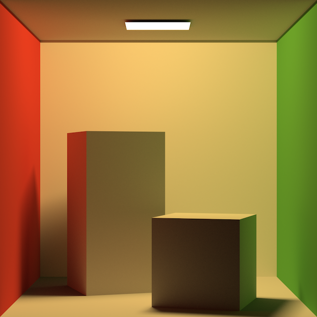

# RT1W


A ray-tracer written in C++, originally based on Peter Shirley's book
*Ray Tracing in one weekend*, and then expanded using the book
*Physically Based Rendering*.

## Building

CMake 3.6+, and libpng are required.

The following options are available:

* *RT1W_WITH_OIDN*, to build using Intel's [Open Image
  Denoise](https://openimagedenoise.github.io) Library.
* *RT1W_WITH_TESTS*, to build the suite of unit tests.

### Example
```bash
$ mkdir build
$ cd build
$ cmake -DCMAKE_BUILD_TYPE=Release -DRT1W_WITH_OIDN=ON -DRT1W_WITH_TESTS=OFF ..
$ make
```
## Running

The only required argument is the path to a JSON file containing the
description of the scene to render.


By default the image is rendered using one sample per pixel. The
*quality* option specify the size of the grid in which a pixel is
divided. In the example above, a total of 16 (4*4) samples are
computed per pixel.

If rt1w has been built with Open Image Denoise an optional denoising
step can be added after rendering using the *denoise* option.

In order to achieve better denoising results, the normals and albedo
of the scene is computed. It's possible to export them by passing the
options *--normals* and/or *--albedo*.

The full list of options is available using:
```bash
$ ./rt1w --help
```

### Example
```bash
$ ./rt1w --quality=4 --denoise scenes/earth.json
```

## Scene Description

The scene to be rendered is described in a JSON file. It contains a
list of textures, shapes, materials, lights, primitives, a camera and
a list of options.

Each entry for the textures, shapes and materials have a mandatory
*name* field, so that they can be referenced. The other mandatory
field is *type*, then the rest of the key-value pairs are specific to
the type of each object.

### Shapes

Currently, only Spheres and Triangles Meshes are supported so the
possible values for *type* is either *sphere* or *mesh*. An optional
*transform* can be provided to place the Shape in space.

#### Sphere

| Key       | Value    |
|-----------|----------|
| type      | "sphere" |
| name      | String   |
| radius    | Number   |
| transform | Object   |

#### Mesh

| Key       | Value                   |
|-----------|-------------------------|
| type      | "mesh"                  |
| name      | String                  |
| count     | Number (Triangle count) |
| vertices  | Array of 3d vectors     |
| normals   | Array of 3d vectors     |
| uv        | Array of 2d vectors     |
| indices   | Array of Numbers        |
| transform | Object                  |

#### Transforms

There are three ways to specify a transform:

* A 4x4 matrix in row-major notation.
* An Object with a single key-value pair, the name of the transform
  and its argument.
* An array of transforms to be concatenated.

| Name      | Argument                 |
|-----------|--------------------------|
| rotate    | 4d vector (angle + axis) |
| scale     | 3d vector                |
| translate | 3d vector                |

### Textures

Textures are defined separately, and can later be used for describing
materials or an Environment Light.  Three types of textures are
supported: Constant, Image or Checker. Only PNG images are supported.

#### Constant

| Key   | Value           |
|-------|-----------------|
| type  | "constant"      |
| name  | String          |
| color | 3d vector (RGB) |


#### Image

The file path can be specified either as an absolute path or relative
to where the JSON file is located.  The *origin* and *size* are
optional parameters that specify, in pixel, which region of the image
to use.

| Key    | Value     |
|--------|-----------|
| type   | "image"   |
| name   | String    |
| file   | String    |
| origin | 2d vector |
| size   | 2d vector |

#### Checker

A checker texture is created using two other textures.

| Key  | Value     |
|------|-----------|
| type | "checker" |
| name | String    |
| odd  | String    |
| even | String    |

### Materials

The three types of materials supported are Matte, Metal and
Dielectric. Like Textures and Shapes, a material needs to be named in
order to be referenced when creating a Primitive.

#### Matte

Only one parameter is needed, the name of a texture.

| Key  | Value   |
|------|---------|
| type | "matte" |
| name | String  |
| Kd   | String  |

#### Metal

Metal materials are described by two parameters, the name of a
previously defined texture and a *fuzz* parameter that is the
roughness of the material, 0 for a mirror like surface.


| Key     | Value   |
|---------|---------|
| type    | "metal" |
| name    | String  |
| texture | String  |
| fuzz    | Number  |

#### Dielectric

The only parameter used is the refraction index of the Dielectric material.

| Key        | Value        |
|------------|--------------|
| type       | "dielectric" |
| name       | String       |
| refraction | Number       |

### Primitives

There are two ways to create a primitive, by providing the name of a
shape and a material. Or by giving the path to an OBJ file.

```json
    "primitives": [
        { "shape": "my-shape", "material": "my-material" },
        { "file": "bunny.obj" }
    ]
```

### Lights

Three type of lights are supported in rt1w, *Point*, *Area* and
*Environment*

#### Point Light

A point light is described by its position and its color.

| Key      | Value           |
|----------|-----------------|
| type     | "point"         |
| position | 3d vector       |
| emit     | 3d vector (RGB) |

#### Area Light

An area light uses the name of a previously declared shape and a 3d
vector specifying its color.

| Key   | Value           |
|-------|-----------------|
| type  | "area"          |
| shape | String          |
| emit  | 3d vector (RGB) |


#### Environment Light

The *radiance* parameter is the name of a texture that will be used as
a radiance map, its values will be scaled by the 3d vector provided as
the *scale* parameter.

| Key      | Value         |
|----------|---------------|
| type     | "environment" |
| scale    | 3d vector     |
| radiance | String        |

### Camera

Two types of cameras are supported, perspective or orthographic
projection.  They are described by the same set of parameters with the
perspective camera needing an additional parameter for its field of
view. If some parameters are not supplied, then default values are
used instead.


> Note: Because rt1w uses a right-handed coordinate systems, the
> camera is looking toward -z.


| Key           | Value                           | Default     |
|---------------|---------------------------------|-------------|
| type          | "perspective" or "orthographic" |             |
| position      | 3d vector                       | [0 1 0]     |
| lookat        | 3d vector                       | [0 0 0]     |
| up            | 3d vector                       | [0 1 0]     |
| resolution    | 2d vector                       | [1920 1080] |
| aperture      | Number                          | 0           |
| focusdistance | Number                          | 0           |
| znear         | Number                          | -0.1        |
| zfar          | Number                          | -1000       |
| fov           | Number                          | 60          |

### Options

The *option* Object can be used to specify the name of the output file
and the method used for rendering (either Whitted's algorithm or Path
tracing, default to the latter).

| key        | value               |
|------------|---------------------|
| output     | String              |
| integrator | "whitted" or "path" |

## Multithreading & Acceleration

Multithreading is implemented using the thread library from the
STL. The render is broken down into tiles and each thread is given a
tile to render. Once done, the thread asks for another tile until the
render is completed.

A Bounding Volume Hierarchy is used for faster ray-shape intersection.


## TODO

* On macOS, use Metal Performance Shaders for ray-shape intersection.
* Correctly load materials from obj file.
* Implement [Disney BRDF](https://disney-animation.s3.amazonaws.com/uploads/production/publication_asset/48/asset/s2012_pbs_disney_brdf_notes_v3.pdf).
* Correct color space conversions.
* Spectral rendering.

## License
MIT License.
